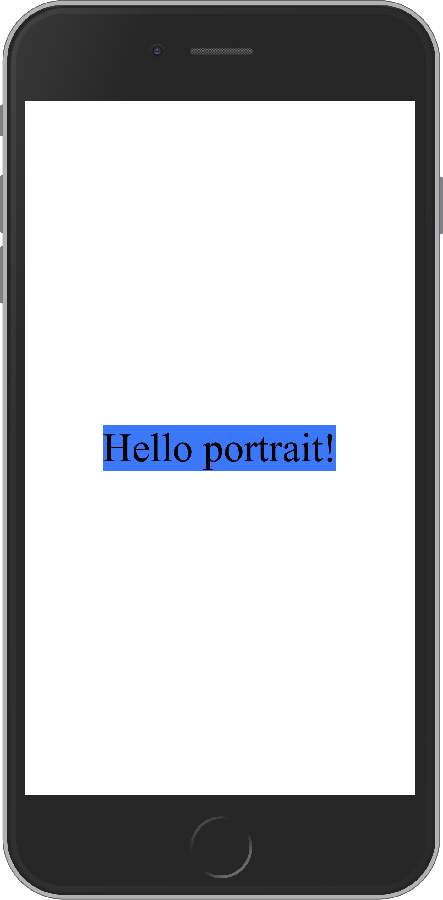
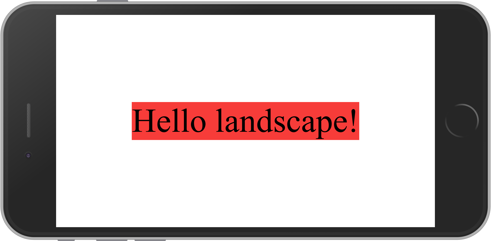

# DaBR.js - Dynamic and Beautiful Rectangles

**DaBR** is a javascript library to design user interfaces without direct contact with HTML and CSS. Instead of those, DaBR is centered on the definition of **Rectangles**, javascript objects where **layout**, **styling** and **dynamic behavior** are described declaretively.

DaBR should be interesting for those who are looking for alternatives to HTML+CSS design but still enjoy the reactivity provided by libraries like React or Vue.

DaBR is an opinionated take on frontend web development. If you like the concept as much as I do, please let me know! DaBR is currently in beta and contributions (as code or ideas) are very welcome (see the contribution guidelines).

# Philosophies

- **Beautiful Rectangles:** The main abstraction DaBR uses is the one of a **Rectangle**, or **Rect**. In DaBR, UIs are described as a **tree of rectangles**, which is a very intuitive way to design UIs: have you ever sketched a website on paper by drawing a bunch of rectangles and describing their functionality? This is how DaBR design should feel like!

- **Dynamic Rectangles:** Attributes inside Rectangles are defined as **nodes**, special objects that store dynamic information. Everytime the value of a node changes, it triggers **transitions**, which **react** to the change efficiently. Nodes and transitions form a **network of reactivity** which is useful to design complex dynamic interactions between components. An advantage of nodes is that they can be controlled by any piece of javascript (even from another library/framework!) and the reactivity would still work.

- **Everything is just data (and functions manipulate data!):** Since rectangles and nodes are **just data**, components are defined using the simplest abstraction in programming: **functions**! Functions should be used not only to **define** Rects, but also to **transform** them. A standard DaBR workflow is to start defining barebones Rects, with only core layout and behavior, and use functions to **add** style, behavior, or anything really, later.

- **Incrementally Adoptable:** You can start using DaBR to design only a few elements in your application since the **node/transition** mechanism works even if node values are set by another library (be it React, Vue, or just vanilla Javascript). It is also easy to integrate DOM based APIs with DaBR since every Rect has direct access to its DOM element, which can be interacted with if needed.

- **General, Simple and Extensible:** DaBR's core is **simple** but **general**, which means the way DaBR solves **specific** design problems is by building functions on top of its basic core. This philosophy is completely different from the HTML+CSS design philosophy, which solves specific problems well, but is not general and extensible.

# Example

You can find more examples in the [examples](examples) directory (soon). 

Here is a simple example that shows nodes, transitions and rectangles in action. You can check it completely [here](examples/example2).

```javascript
const isPortrait = tran(screenSize(), ([w, h]) => h > w);

const tree = Tree(
    Rect({
        layout: {
            pos: [20, 20],
            siz: [60, 60]
        },
        style: {
            color: tran(isPortrait, isIt => (isIt ? 'blue' : 'red'))
        }
    })
);

const text = tran(
    isPortrait,
    isIt => 'Hello ' + (isIt ? ' portrait!' : 'landscape!')
);

run(fitText(text, tree));
```

Portrait |  Landscape
:-------------------------:|:-------------------------:
  |  

This example creates an `isPortrait` node using the `screenSize` node, available in [.src/lib](lib), to describe whether the smartphone (or desktop) is in *portrait* or *landscape* mode depending on the dimensions of the screen. The `isPortrait` node is then used to dynamically change the `Rect`'s `color` and `text`.

# Current 

## Status

DaBR is in **beta** so breaking changes may happen. An alpha release will probably happen after both correctness and performance tests pass.

## Goals

Current goals are divided into **milestones**:

- **Correctness:** development tests and bug fixes
- **Performance:** performance tests and changes that improve both memory consumption and script time
- **API:** improvements to the API are always important
- **Documentation:** improving documentation and adding more examples
- **Code Cleaning:** cleaning old code or refactoring for better readability
- **Chore:** anything like continuous integration, readme, etc

# How to use it

Add dabr as a dependency using `npm`, `yarn` or other tool.

# Documentation

Documentation is under development.

# Contributing

## Contribution Guidelines

Being incrementally detailed. For now you may:

- Open an issue, associate it to one of the milestones
- You may branch the `dev` branch and open a pull request
- Commiting messages should describe one of the *milestones* at the start (example: [API] ...)

## Contact

Email: luizss [at] dabrjs.org

## License

[MIT license](./LICENSE)

Copyright (c) 2020-present Luiz Gustavo Soares de Sá
